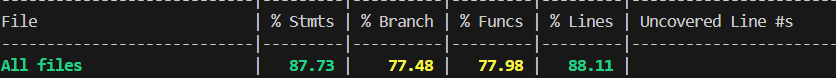

TEMPLATE FOR RETROSPECTIVE (Team 16)
=====================================

The retrospective should include _at least_ the following
sections:

- [process measures](#process-measures)
- [quality measures](#quality-measures)
- [general assessment](#assessment)

## PROCESS MEASURES 

### Macro statistics

- Number of stories committed vs. done : 4 / 4
- Total points committed vs. done : 10 / 10
- Nr of hours planned vs. spent (as a team): 2w 2d 56 m / 2w 2d

**Remember** a story is done ONLY if it fits the Definition of Done:
 
- Unit Tests passing
- Code review completed
- Code present on VCS
- End-to-End tests performed

> Please refine your DoD if required (you cannot remove items!) 

### Detailed statistics

    | Story                | # Tasks | Points | Hours est.   | Hours actual |
    |----------------------|---------|--------|--------------|--------------|
    | _Uncategorized_      | 19      | //     | 1w 1d 6h 50m | 1w 1d 6h 11m |
    | PT8: Report overview | 6       | 2      | 5h 50m       | 7h 50m       |
    | PT9:                 | 7       | 2      | 6h           | 6h           |
    | PT10:                | 10      | 1      | 1d 6h 50m    | 2d           |
    | PT11:                | 8       | 5      | 1d 6o 30m    | 1d 4h 55m    |

> story `Uncategorized` is for technical tasks, leave out story points (not applicable in this case)

- Hours per task average, standard deviation (estimate and actual)

|            | Mean | StDev |
|------------|------|-------|
| Estimation |      |       |
| Actual     |      |       |

- Total estimation error ratio: sum of total hours spent / sum of total hours effort - 1

    $$\frac{\sum_i spent_{task_i}}{\sum_i estimation_{task_i}} - 1 =  $$
    
- Absolute relative task estimation error: sum( abs( spent-task-i / estimation-task-i - 1))/n

    $$\frac{1}{n}\sum_i^n \left| \frac{spent_{task_i}}{estimation_task_i}-1 \right| =  $$
  
## QUALITY MEASURES 

- Unit Testing:
  - Total hours estimated : 9
  - Total hours spent : 8h 40m
  - Nr of automated unit test cases : 92
  
- E2E testing:
  - Total hours estimated : 
  - Total hours spent : 
  - Nr of test cases : 
- Code review 
  - Total hours estimated : 
  - Total hours spent : 
  
## ASSESSMENT

- What did go wrong in the sprint?
  + we had less communication within the internal groups so we spent more time in some cases
  + we haven't read properly one story description and wasted time solving what we had already done
- What caused your errors in estimation (if any)?
  + not errors directly linked to estimation but to less communication other than scrum meetings
- What lessons did you learn (both positive and negative) in this sprint?
  + We should communicate more with each other and ask more for correctness of stories implemented
  + Also read better documentation to get all along with the routes and implementation details
- Which improvement goals set in the previous retrospective were you able to achieve? 
  + we fixed all issues opened and implemented old and new stories test
  + we wrote a better and clearer swagger document to follow during implementation
- Which ones you were not able to achieve? Why?
  + 
- Improvement goals for the next sprint and how to achieve them (technical tasks, team coordination, etc.)
  + ask more for teammates approvement in order to continue the implementation and not checking already done stories for bug or doubts
  + 

- One thing you are proud of as a Team!!
  + we all get along with new decision, also we manage to have usually a similar way of approaching tasks estimation and logic implementation